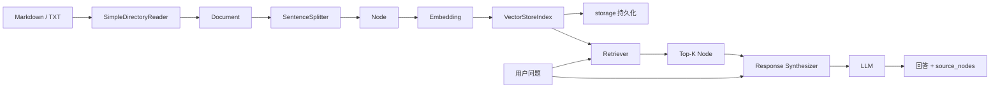

# 项目架构与代码导览

## 目录结构

```text
llamaIndex/
├── data/                         # 本地知识库样例
├── docs/                         # 中文学习文档
├── src/llamaindex_demo/
│   ├── cli.py                    # 命令行入口与功能编排
│   ├── config.py                 # 环境变量、项目路径
│   ├── models.py                 # local/OpenAI 模型工厂
│   ├── local_models.py           # 教学用 CustomLLM/BaseEmbedding
│   ├── rag.py                    # 加载、摄取、索引、检索、问答、总结
│   ├── router.py                 # 查询路由
│   ├── structured.py             # Pydantic 结构化输出
│   ├── evaluation.py             # 检索评估
│   ├── workflow.py               # 事件驱动的 RAG 编排
│   └── agent.py                  # OpenAI 工具调用 Agent
├── tests/                        # 离线单元测试
├── .env.example                  # 环境变量模板
├── pyproject.toml                # 包配置与依赖
└── README.md                     # 快速开始
```

## RAG 数据流



离线建库和在线查询是两个不同阶段。生产系统通常不会在每次请求中重新加载全部文件；它会由独立摄取任务更新向量库，查询服务只读取已建立的索引。

## 关键对象之间的区别

| 对象 | 职责 | 本项目位置 |
|---|---|---|
| `Document` | 表示一份输入资料及 metadata | `load_documents` 输出 |
| `Node` | 可索引、可检索的较小内容块 | `parse_documents` 输出 |
| `Embedding` | 把文本映射成向量 | `models.py` |
| `Index` | 组织数据，提供 Retriever/QueryEngine | `build_vector_index` |
| `Retriever` | 根据 Query 找候选 Node | `retrieve` |
| `QueryEngine` | 单轮查询的完整编排 | `make_query_engine` |
| `ChatEngine` | 加入历史信息的多轮查询 | `command_chat` |
| `Memory` | 保存与压缩对话历史 | `command_chat` |
| `Response` | 最终文本、来源节点及 metadata | CLI 输出 |

## 标准 QueryEngine 与 Workflow 怎么选

普通“检索后回答”优先使用 QueryEngine：代码少、框架内置优化多。若流程包含多分支、循环重试、并行步骤、人工审核或长期状态，再使用 Workflow。`workflow.py` 为了教学把标准 RAG 拆成 `RetrievedEvent` 前后的两个异步 step；真实项目可以继续添加事件与分支。

Agent 则适合“下一步行动无法预先写死”的任务：LLM 根据当前上下文选择工具并可能连续执行。它引入更高成本和不确定性，因此普通知识问答不必为了使用 Agent 而使用 Agent。本项目的 Agent 只在 OpenAI 模式开放，因为 FunctionAgent 依赖真实 function calling 能力。

## 为什么提供两套模型

`models.configure_models` 是模型边界。local 模式实现相同的 LlamaIndex 抽象接口，因此上层索引、检索、QueryEngine 无需改变。

- `LocalHashEmbedding` 使用字符哈希，只能捕捉字面重合；
- `LocalExtractiveLLM` 从检索上下文抽取句子，不具备通用推理；
- OpenAI 模式具备真正语义嵌入与自然语言生成能力，但需要网络、密钥并产生费用。

这种设计也说明了 LlamaIndex 并不是一个模型，而是连接数据、模型和工作流的框架。

## 持久化内容

`StorageContext.persist()` 默认写入多个 JSON 文件，包括：

- docstore：Node 内容与关系；
- index store：索引结构；
- vector store：节点向量；
- graph store：关系图存储。

本项目把生成的 `storage/` 加入 `.gitignore`。教学用 JSON 向量库适合小数据；生产环境可以换成 Qdrant、Milvus、Pinecone、PostgreSQL/pgvector 等，业务上层仍可保持相近接口。
