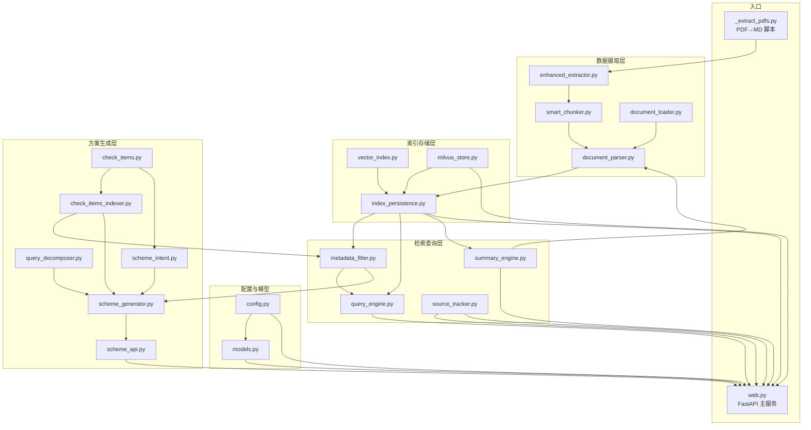

# qualityScheme 模块架构与文件关系说明

> 本文档梳理 `qualityScheme/` 目录下所有源码文件之间的职责分层、依赖关系与数据流向，便于快速理解整个质检规范 RAG 系统的组成与协作方式。

## 1. 概述

`qualityScheme` 是基于 LlamaIndex 实现的"实景三维质检大数据支撑库 · 时空数据规范"RAG 业务包。

- **数据源**：`standard/` 下的 7 部时空数据规范 PDF（已提取为 `data/*.md`）
- **存储**：向量数据写入 Milvus（不再使用本地 JSON）
- **模型**：支持 `local`（Ollama）与 `openai`（兼容 OpenAI 接口）两种模式
- **服务**：FastAPI（默认端口 `8001`，与 demo 的 `8000` 隔离）
- **前端**：原生 HTML/JS 静态页面（`static/`）

整体目标：根据用户自然语言需求，从规范文档中检索相关条款，结合预定义检查项清单，生成结构化的"质检方案"。

## 2. 目录结构总览

```
qualityScheme/
├── __init__.py              # 包标识与版本
├── _extract_pdfs.py         # 一次性 PDF→Markdown 提取脚本（数据准备入口）
├── config.py                # 业务配置（.env 加载、Milvus/LLM 参数校验）
│
├── ── 数据摄取层 ──
├── enhanced_extractor.py    # 增强版 PDF 提取器：去噪/章节解析/metadata 推断
├── smart_chunker.py         # 结构感知切块器：从增强 Markdown 生成带富 metadata 的 Node
├── document_loader.py       # 通用 Markdown/TXT 文档加载（SimpleDirectoryReader）
├── document_parser.py       # 摄取管道：切块 + Embedding，产出带向量的 Node
│
├── ── 索引/存储层 ──
├── vector_index.py          # VectorStoreIndex 构造（可注入 Milvus）
├── milvus_store.py          # Milvus 向量库工厂（探测维度/建库/建 collection）
├── index_persistence.py     # 索引构建与持久化编排（加载已有 or 全量摄取）
│
├── ── 检索/查询层 ──
├── metadata_filter.py      # metadata 过滤 + Hybrid Search（Dense + BM25）
├── query_engine.py          # QueryEngine 构造（top_k / response_mode / streaming）
├── source_tracker.py        # 检索来源格式化（NodeWithScore → 可读来源）
├── summary_engine.py        # 全文总结引擎（SummaryIndex + tree_summarize）
│
├── ── 质检方案生成层 ──
├── check_items.py           # 28 项预定义检查项清单与参数规范化
├── check_items_indexer.py   # 检查项入库（带 Embedding）+ 候选格式化 + 白名单
├── query_decomposer.py      # 复合需求分解为多个子意图（LLM + 规则兜底）
├── scheme_intent.py          # 意图识别：判断输入是否为真实质检需求
├── scheme_generator.py      # 方案生成主编排（分解→检索→候选→LLM 生成→校验）
│
├── ── 模型与 API 层 ──
├── models.py                # LLM/Embedding 模型配置（local=Ollama / openai）
├── scheme_api.py            # 方案生成相关路由（/api/scheme/*）
├── web.py                   # FastAPI 主服务（编排所有模块，暴露 /api/*）
│
├── data/                    # 7 部规范 Markdown 数据源
│   ├── part1_数据分类与基本规定.md
│   ├── part2_检测点.md
│   ├── part3_检测线.md
│   ├── part4_标志性地物.md
│   ├── part5_重要要素.md
│   ├── part6_高精度栅格数据.md
│   └── part7_资源数据.md
└── static/                  # 前端静态资源
    ├── index.html
    ├── app.js
    └── style.css
```

## 3. 分层架构

| 层 | 职责 | 主要文件 |
|---|---|---|
| **数据准备** | PDF 规范 → 结构化 Markdown | `_extract_pdfs.py`, `enhanced_extractor.py` |
| **数据摄取** | Markdown → 带 metadata + 向量的 Node | `smart_chunker.py`, `document_loader.py`, `document_parser.py` |
| **索引/存储** | Node → Milvus 持久化向量索引 | `vector_index.py`, `milvus_store.py`, `index_persistence.py` |
| **检索/查询** | 向量检索 + Hybrid + metadata 过滤 | `metadata_filter.py`, `query_engine.py`, `source_tracker.py`, `summary_engine.py` |
| **方案生成** | 自然语言需求 → 结构化质检方案 | `check_items.py`, `check_items_indexer.py`, `query_decomposer.py`, `scheme_intent.py`, `scheme_generator.py` |
| **模型/配置** | LLM/Embedding/Milvus 统一配置 | `config.py`, `models.py` |
| **API/前端** | FastAPI 路由 + 静态页面 | `web.py`, `scheme_api.py`, `static/*` |

## 4. 模块依赖关系

### 4.1 依赖矩阵（仅列本目录内模块）

| 模块 | 依赖的本目录模块 |
|---|---|
| `web.py` | `config`, `models`, `milvus_store`, `index_persistence`, `query_engine`, `source_tracker`, `summary_engine`, `scheme_api`, `metadata_filter`, `document_loader`, `document_parser` |
| `scheme_api.py` | `check_items`, `scheme_generator`, `scheme_intent` |
| `scheme_generator.py` | `check_items`, `check_items_indexer`, `metadata_filter`, `query_decomposer` |
| `scheme_intent.py` | `check_items` |
| `check_items_indexer.py` | `check_items` |
| `metadata_filter.py` | `check_items_indexer` |
| `index_persistence.py` | `document_loader`, `document_parser`, `vector_index` |
| `summary_engine.py` | `document_parser` |
| `smart_chunker.py` | `enhanced_extractor` |
| `document_parser.py` | `smart_chunker`（通过 `load_documents_with_enhanced_metadata`） |
| `models.py` | `config` |
| `query_engine.py` | 无本目录依赖（仅接收外部传入的 index/llm/embed_model） |
| `vector_index.py` | 无本目录依赖 |
| `milvus_store.py` | 仅类型提示引用 `config.QualitySchemeConfig` |
| `source_tracker.py` | 无本目录依赖 |
| `query_decomposer.py` | 无本目录依赖 |
| `enhanced_extractor.py` | 无本目录依赖 |
| `document_loader.py` | 无本目录依赖 |
| `check_items.py` | 无本目录依赖（检查项知识源头） |
| `_extract_pdfs.py` | 无本目录依赖（独立脚本） |

### 4.2 依赖关系图



## 5. 核心数据流

### 5.1 离线数据准备（一次性）

```
standard/*.pdf
   │
   ├──(简单)─→ _extract_pdfs.py ─→ data/*.md
   │
   └──(增强)─→ enhanced_extractor.run_enhanced_extraction()
                    │
                    └→ smart_chunker.rebuild_from_standard_to_nodes()
                            │
                            └→ 带富 metadata 的 Node（可直接喂给摄取层）
```

### 5.2 索引构建与持久化

```
data/*.md
   │
   ▼
document_loader.load_documents()       # SimpleDirectoryReader 加载 Markdown
   │
   ▼
document_parser.parse_documents()      # 调用 smart_chunker 切块 + Embedding
   │
   ▼
vector_index.build_vector_index()      # 构造 VectorStoreIndex
   │
   ▼
milvus_store.create_milvus_vector_store()  # 写入 Milvus collection
   │
   ▼
index_persistence.build_and_persist_index() # 编排上述全流程，启动时由 web.py 调用
```

### 5.3 通用 RAG 查询

```
HTTP POST /api/retrieve
   │
   ▼
web.py 路由处理函数
   │  └─ require_runtime() 取出 (cfg, llm, embed_model, index)
   ▼
metadata_filter.retrieve()             # Hybrid Search + metadata filter
   │  └─ retrieve_check_items() / retrieve_quality_context()
   ▼
source_tracker.format_sources()        # NodeWithScore → 可读来源
   │
   ▼
返回 JSON {answer, sources}
```

### 5.4 质检方案生成（核心业务流）

```
HTTP POST /api/scheme/generate {requirement, context_top_k}
   │
   ▼
scheme_api.generate_scheme_endpoint()
   │
   ├─→ scheme_intent.recognize_scheme_intent()   # 意图识别
   │       │
   │       └─→ 非质检需求：返回 {status:"rejected", suggestion}
   │
   ▼ （是质检需求）
scheme_generator.generate_scheme()
   │
   ├─→ query_decomposer.decompose_query()         # 复合需求 → 子意图列表
   │
   ├─→ metadata_filter.retrieve_quality_context() # 每个子意图检索规范条款
   │
   ├─→ check_items_indexer.format_top_check_items_for_prompt()  # 候选检查项
   │
   ├─→ LLM 结构化生成（Pydantic 校验）
   │
   ├─→ check_items.is_valid_check_code() 白名单校验
   │
   └─→ canonicalize_params() 参数规范化
   │
   ▼
返回结构化质检方案 {schemeName, checkItem:[{checkCode, params, source}]}
```

### 5.5 全文总结（带两级缓存）

```
HTTP GET /api/summary
   │
   ▼
web.py 路由
   │  └─ 命中 answer_cache → 直接返回
   │  └─ 命中 nodes_cache  → 跳过摄取，复用 Node
   ▼
summary_engine.make_summary_engine()
   │  └─ SummaryIndex + tree_summarize 覆盖全部规范
   ▼
返回 {summary, sources}
（rebuild 时两级缓存自动清空）
```

## 6. 前端与后端对接

| 前端文件 | 调用后端接口 | 用途 |
|---|---|---|
| `static/index.html` | — | 方案编排面板、RAG 查询面板、使用说明 |
| `static/app.js` | `/api/quickstart`, `/api/retrieve`, `/api/retrieve/part`, `/api/scheme/generate` | 通过 `fetch` 发送 JSON 请求并渲染结果 |
| `static/style.css` | — | 页面样式 |

`app.js` 内部封装了 `postJSON()` 通用请求工具，所有请求统一打到 `/api/*` 前缀。

## 7. API 端点清单

| 方法 | 路径 | 注册位置 | 功能 |
|---|---|---|---|
| GET | `/api/health` | `web.py` | 健康检查 + 运行时状态 |
| POST | `/api/rebuild` | `web.py` | 强制重建索引 |
| POST | `/api/quickstart` | `web.py` | 一站式 RAG 问答 |
| POST | `/api/async` | `web.py` | 异步问答（任务态轮询） |
| POST | `/api/stream` | `web.py` | SSE 流式问答 |
| POST | `/api/retrieve` | `web.py` | 通用检索 |
| POST | `/api/retrieve/part` | `web.py` | 按 part_number 子集检索 |
| GET | `/api/summary` | `web.py` | 全文总结（两级缓存） |
| GET | `/api/scheme/check-items` | `scheme_api.py` | 预定义检查项清单 |
| POST | `/api/scheme/generate` | `scheme_api.py` | 自然语言生成质检方案 |

> 说明：`scheme_api.py` 通过 `register_scheme_routes(app, require_runtime)` 由 `web.py` 调用注册，避免与 `web.py` 主流程产生循环依赖。`require_runtime()` 是 `web.py` 暴露给所有路由的共享运行时访问器，返回 `(config, llm, embed_model, index)`。

## 8. 关键配置项（`.env`）

| 环境变量 | 必需 | 说明 |
|---|---|---|
| `QUALITY_MILVUS_URI` | 是 | Milvus 连接地址，如 `http://milvus-host:19530` |
| `QUALITY_MILVUS_DB` | 是 | Milvus 数据库名 |
| `QUALITY_MILVUS_COLLECTION` | 是 | Milvus collection 名 |
| `LLAMAINDEX_MODEL_PROVIDER` | 否（默认 `local`） | `local`（Ollama）或 `openai` |
| `LLAMAINDEX_LLM_MODEL` | 否 | LLM 模型名 |
| `LLAMAINDEX_EMBED_MODEL` | 否 | Embedding 模型名 |
| `OPENAI_API_KEY` | openai 模式必需 | OpenAI 兼容 API Key |
| `OPENAI_API_BASE` | 否 | 自定义 API 基址 |

**硬约束**：Milvus 三项不允许硬编码默认值，必须通过 `.env` 显式配置，避免内部服务地址泄漏到代码库。`config.load_quality_config()` 会在缺失时直接抛 `RuntimeError`。

## 9. 启动方式

```bash
# 默认 local（Ollama）模式，端口 8001
python -m qualityScheme.web

# 自定义端口
python -m qualityScheme.web --port 8080

# OpenAI 模式 + 强制重建索引
python -m qualityScheme.web --provider openai --rebuild
```

启动时 `web.py` 会：
1. `load_quality_config()` 读取并校验 `.env`
2. `configure_quality_models()` 配置 LLM/Embedding
3. `ensure_milvus_database()` / `create_milvus_vector_store()` 准备向量库
4. `build_and_persist_index()` 加载已有索引或全量摄取写入
5. 构造 `query_engine` / `summary_engine` 放入运行时状态
6. `register_scheme_routes()` 挂载方案生成路由
7. 挂载 `static/` 为前端静态资源
8. `uvicorn` 启动 FastAPI

## 10. 文件功能速查

| 文件 | 一句话职责 |
|---|---|
| `__init__.py` | 包标识，版本 `0.1.0` |
| `_extract_pdfs.py` | PDF→Markdown 一次性提取脚本（数据准备入口） |
| `config.py` | 加载 `.env`，校验 Milvus/LLM 必需配置项 |
| `enhanced_extractor.py` | 增强 PDF 提取：去噪/章节解析/metadata 推断 |
| `smart_chunker.py` | 结构感知切块：从增强 Markdown 产出带富 metadata 的 Node |
| `document_loader.py` | `SimpleDirectoryReader` 加载 `data/` 下 Markdown |
| `document_parser.py` | 摄取管道：切块 + Embedding |
| `vector_index.py` | 构造 `VectorStoreIndex`（可注入 Milvus） |
| `milvus_store.py` | Milvus 向量库工厂：建库/建 collection/检查数据 |
| `index_persistence.py` | 索引构建与持久化编排（核心） |
| `metadata_filter.py` | metadata 过滤 + Hybrid Search（Dense + BM25） |
| `query_engine.py` | `QueryEngine` 构造 |
| `source_tracker.py` | 检索来源格式化 |
| `summary_engine.py` | 全文总结引擎（`SummaryIndex` + `tree_summarize`） |
| `check_items.py` | 28 项预定义检查项清单 + 参数规范化 |
| `check_items_indexer.py` | 检查项入库 + 候选格式化 + 白名单提取 |
| `query_decomposer.py` | 复合需求分解为子意图（LLM + 规则兜底） |
| `scheme_intent.py` | 意图识别（判断是否为真实质检需求） |
| `scheme_generator.py` | 方案生成主编排 |
| `models.py` | LLM/Embedding 模型配置（Ollama / OpenAI） |
| `scheme_api.py` | 方案生成路由注册（`/api/scheme/*`） |
| `web.py` | FastAPI 主服务，编排所有模块 |
| `data/` | 7 部规范 Markdown 数据源 |
| `static/` | 前端静态资源（HTML/JS/CSS） |
